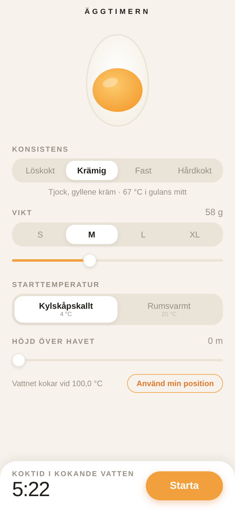
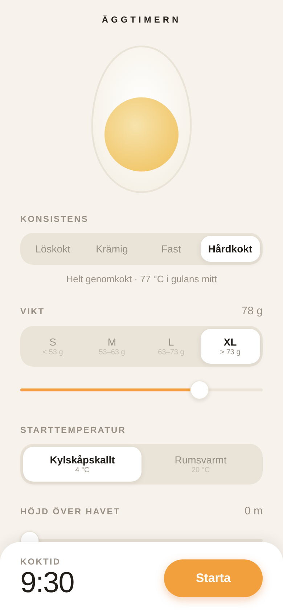
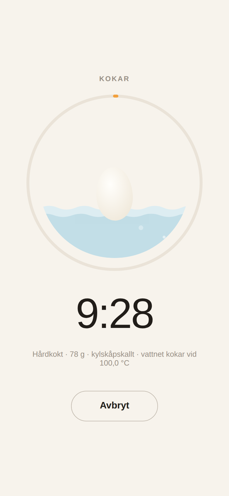
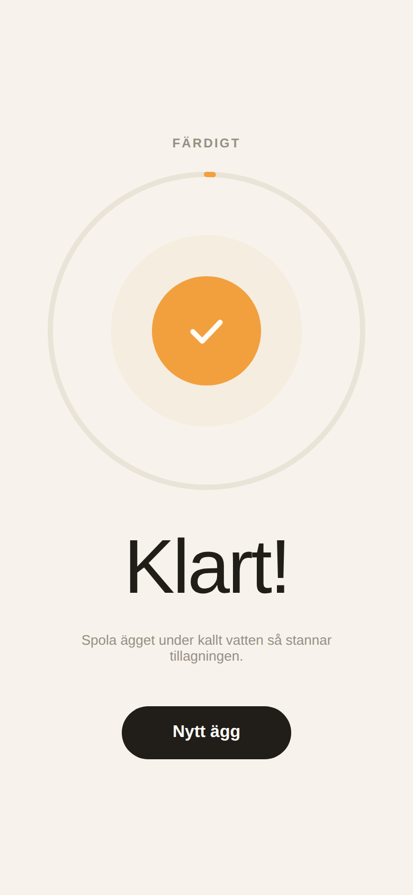

# Äggtimern 🥚

Den ultimata äggklockan — en minimalistisk mobilapp (Expo/React Native, iOS + Android) som
räknar ut den exakta koktiden utifrån äggets vikt, starttemperatur, önskad konsistens och
höjden över havet. Ägget förutsätts läggas i redan kokande vatten.

| Inställningar | Hårdkokt XL | Timer | Klart |
| --- | --- | --- | --- |
|  |  |  |  |

## Funktioner

- **Vikt** — förinställda EU-klasser (S < 53 g, M 53–63 g, L 63–73 g, XL > 73 g) eller
  exakt vikt med reglage, 40–90 g.
- **Starttemperatur** — kylskåpskallt (4 °C) eller rumsvarmt (20 °C).
- **Konsistens** — löskokt, krämig, fast eller hårdkokt, med levande förhandsvisning av
  gulan i äggets tvärsnitt.
- **Höjd över havet** — reglage eller via position: appen slår upp exakt markhöjd i
  Open-Meteos höjddatabas (stabilare än rå GPS-höjd). Vattnets faktiska kokpunkt räknas
  ut och förlänger koktiden. Blir önskad konsistens fysikaliskt omöjlig (gulan kan aldrig
  bli varmare än vattnet) varnar appen.
- **Flera ägg samtidigt** — lägg alla ägg i kastrullen på en gång; appen larmar när varje
  ägg ska tas upp, i tur och ordning.
- **Larm som inte ger sig** — ihållande ljud- och vibrationslarm tills ägget kvitteras som
  upptaget. Mobilappen skickar lokala notiser även i bakgrunden; webbversionen håller
  skärmen vaken med Wake Lock.
- **Minns dina val** — vikt, konsistens, temperatur och höjd sparas mellan starter.
- **Timer** — animerad förloppsring, ägg som guppar i sjudande vatten och tydligt
  klart-läge. Nedräkningen utgår från klockslag, så den drabbas inte av drift om appen
  hamnar i bakgrunden.

## Fysiken

Koktiden beräknas med Charles D. H. Williams formel (University of Exeter, publicerad via
New Scientist 1998), som modellerar ägget som en sfär med jämn värmeledning:

```
t = 0,451 · M^(2/3) · ln( 0,76 · (T_vatten − T_ägg) / (T_vatten − T_gula) )
```

- `t` — koktid i minuter
- `M` — äggets massa i gram
- `T_vatten` — vattnets temperatur (kokpunkten vid aktuell höjd)
- `T_ägg` — äggets starttemperatur
- `T_gula` — måltemperatur i gulans mitt

Konstanten 0,451 min/g^⅔ följer av äggets termiska egenskaper (värmekapacitet ≈ 3,7 J/g·K,
densitet ≈ 1,038 g/cm³, värmeledningsförmåga ≈ 5,4·10⁻³ W/cm·K) och faktorn 0,76 av den
sfäriska geometrin.

**Konsistens = gulans temperatur.** Gulan börjar tjockna vid ~63 °C, är krämig ("jammy")
runt 67 °C, mjukt fast vid ~71 °C och helt fast vid ~77 °C. Appens fyra lägen motsvarar
just de måltemperaturerna.

**Höjden över havet** sänker kokpunkten med ungefär 1 °C per 300 m. Appen beräknar
lufttrycket med barometriska formeln och kokpunkten med Clausius–Clapeyrons ekvation:
havsnivå 100 °C, Denver (1 609 m) ≈ 95 °C, Mount Everest (8 849 m) ≈ 71 °C — där är ett
hårdkokt ägg fysikaliskt omöjligt, vilket appen upptäcker och förklarar.

Hela modellen ligger i [`src/physics/egg.ts`](src/physics/egg.ts) med enhetstester i
[`src/physics/egg.test.ts`](src/physics/egg.test.ts).

### Källor

- [The Science of Boiling an Egg — C. D. H. Williams, University of Exeter](https://newton.ex.ac.uk/teaching/cdhw/egg/)
- [Towards the perfect soft boiled egg — Khymos](https://khymos.org/2009/04/09/towards-the-perfect-soft-boiled-egg/)
- [The Egg Calculator — ChefSteps](https://www.chefsteps.com/activities/the-egg-calculator)
- [Sous Vide Egg Guide — Anova Culinary](https://anovaculinary.com/pages/sous-vide-egg-guide)
- [Boiling Point at Altitude — Omni Calculator](https://www.omnicalculator.com/chemistry/boiling-point-altitude)
- [High Altitude Cooking — USDA FSIS](https://www.fsis.usda.gov/food-safety/safe-food-handling-and-preparation/food-safety-basics/high-altitude-cooking)
- [High Elevation Hard-Cooked Eggs — Colorado State University Extension](https://extension.colostate.edu/resource/high-altitude-hard-cooked-eggs/)

## Testa direkt

Webbversionen är en installerbar PWA: **https://drdev1337.github.io/Eggtimer/** —
öppna på mobilen och välj "Lägg till på hemskärmen" så beter den sig som en app,
med egen ikon och offline-stöd. Källan ligger i [`web/`](web/).

## Kom igång

```bash
npm install
npm start        # Expo dev server — skanna QR-koden med Expo Go
npm run ios      # iOS-simulator
npm run android  # Android-emulator
npm run web      # webbläsare
npm test         # enhetstester för fysikmodulen
```

## Struktur

```
App.tsx                        Inställningsskärm och appens tillstånd
src/physics/egg.ts             Williams formel, kokpunkt vid höjd, konstanter
src/theme.ts                   Färger, typografi, spacing
src/components/EggVisual.tsx   Animerat tvärsnitt av ägget
src/components/Segmented.tsx   Segmenterad väljare med fjädrande indikator
src/components/Slider.tsx      Minimal slider (PanResponder, funkar på webb + native)
src/components/TimerScreen.tsx Nedräkning: förloppsring, guppande ägg, klart-läge
```
